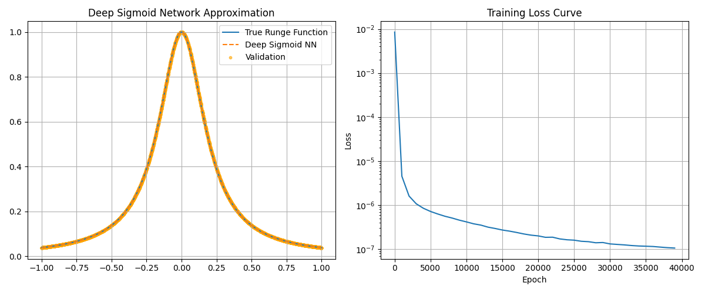
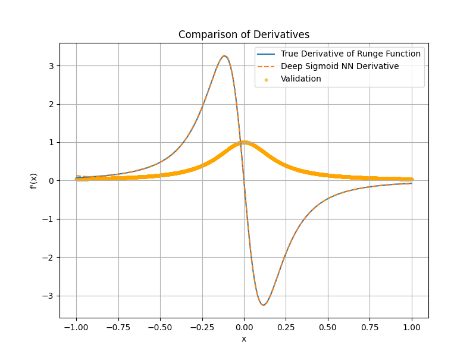
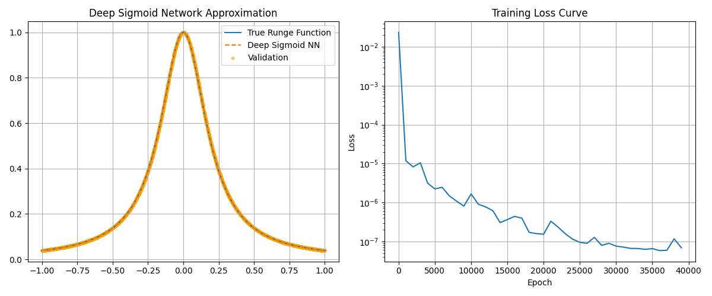
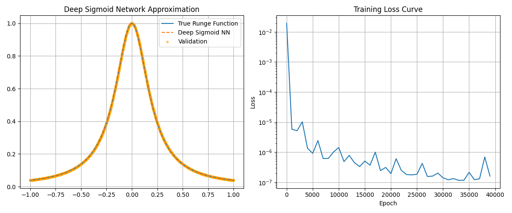
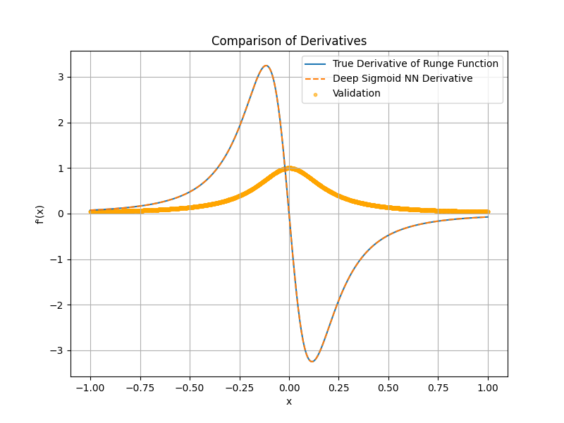

# Written Assignment
# Programming Assignment
> 1. Use the same code from Assignment 2 to calculate the error in approximating the derivative of the given function.

Since the previous program's execution time was too long, I decided to improve the algorithm's efficiency. The underlying logic remains the same, but the computation is more efficient. The revised program is shown below.

```python 
import jax
import jax.numpy as jnp
import matplotlib.pyplot as plt
import time # Import time for performance comparison

# The Runge Function
def f(x):
    return 1/(1+25*x**2)
grad_f = jax.grad(f)
vmap_grad_f = jax.vmap(grad_f)
# Hyperparameters
learning_rate = 0.01
epochs = 40000 # Stop Criterion
datanum = 10001
batch_size = 32
n = 16

# Data
x_train = jnp.linspace(-1.0, 1.0, datanum, dtype=jnp.float32)
y_train = f(x_train)


key = jax.random.PRNGKey(0)

# Validation Data
key, validation_key = jax.random.split(key)
x_validation = jax.random.uniform(validation_key, shape=(4000,), minval=-1.0, maxval=1.0)
y_validation = f(x_validation)

key, w1_key, b1_key, w2_key, b2_key, w3_key, b3_key = jax.random.split(key, 7)
# Initialize parameters
params = {
    'w1': jax.random.normal(w1_key, (1, n)), 'b1': jax.random.normal(b1_key, (n,)),
    'w2': jax.random.normal(w2_key, (n, n)), 'b2': jax.random.normal(b2_key, (n,)),
    'w3': jax.random.normal(w3_key, (n, 1)), 'b3': jax.random.normal(b3_key, (1,))
}

def deep_model(params, x):
    x = x.reshape(-1, 1)
    hidden1 = jax.nn.tanh(x @ params['w1'] + params['b1'])       # tanh and sigmoid are equivalent
    hidden2 = jax.nn.tanh(hidden1 @ params['w2'] + params['b2']) # the tanh function passes through the origin, which can sometimes lead to faster convergence.
    output = hidden2 @ params['w3'] + params['b3']
    return output

# Derivative calculation
def model_for_grad(x, model_params):
    return deep_model(model_params, x).squeeze()

def loss_fn(params, x, y):
    predictions = deep_model(params, x).squeeze()
    return jnp.mean((predictions - y)**2)

# --- Create a JIT-compiled function for the ENTIRE epoch ---
@jax.jit
def train_epoch(params, train_data, permutation):
    x_train, y_train = train_data
    steps_per_epoch = len(x_train) // batch_size

    def body_fun(step, current_params):
        start_idx = step * batch_size
        batch_idx = jax.lax.dynamic_slice_in_dim(permutation, start_idx, batch_size)
        x_batch, y_batch = x_train[batch_idx], y_train[batch_idx]
        grads = jax.grad(loss_fn)(current_params, x_batch, y_batch)
        return jax.tree_util.tree_map(lambda p, g: p - learning_rate * g, current_params, grads)

    params = jax.lax.fori_loop(0, steps_per_epoch, body_fun, params)
    return params

# --- Modified Training Loop ---
loss_history = []
key, shuffle_key = jax.random.split(key)
num_train = len(x_train)
print("\n---Start Training---")
start_time = time.time()

for epoch in range(epochs):
    shuffle_key, perm_key = jax.random.split(shuffle_key)
    perm = jax.random.permutation(perm_key, num_train)
    
    params = train_epoch(params, (x_train, y_train), perm)
    
    if epoch % 1000 == 0:
        loss = loss_fn(params, x_train, y_train)
        loss_history.append(loss)
        print(f"Epoch {epoch}, Loss: {loss:.6f}")

end_time = time.time()
print(f"\nTraining finished in {end_time - start_time:.2f} seconds.")

# --- Evaluation ---
x_plot = jnp.linspace(-1, 1, 500, dtype=jnp.float32)
y_true = f(x_plot)
y_pred = deep_model(params, x_plot).squeeze()
y_pred_train = deep_model(params, x_train).squeeze()
final_mse = loss_fn(params, x_train, y_train)
max_error = jnp.max(jnp.abs(y_pred_train - y_train))

y_pred_validation= deep_model(params, x_validation).squeeze()
validation_mse = loss_fn(params, x_validation, y_validation)
validation_max_error = jnp.max(jnp.abs(y_pred_validation - y_validation))


print(f"\n--- Final Result ---")
print(f"Final Training MSE: {final_mse:.6f}")
print(f"Final Training Max Error: {max_error:.6f}")
print(f"Final Validation MSE: {validation_mse:.6f}")
print(f"Final Training Max Error: {validation_max_error:.6f}")

# --- Plotting ---
plt.figure(figsize=(12, 5))
plt.subplot(1, 2, 1)
plt.plot(x_plot, y_true, label='True Runge Function')
plt.plot(x_plot, y_pred, label='Deep Sigmoid NN', linestyle='--')
plt.scatter(x_validation, y_validation, label='Validation', color='orange', s=10, alpha=0.6)
plt.title('Deep Sigmoid Network Approximation')
plt.legend(); plt.grid(True)
plt.subplot(1, 2, 2)
plt.plot(range(0, epochs, 1000), loss_history)
plt.title('Training Loss Curve'); plt.xlabel('Epoch'); plt.ylabel('Loss'); plt.yscale('log'); plt.grid(True)
plt.tight_layout()
plt.show()


y_d_true = vmap_grad_f(x_plot) 
y_d_true_validation = vmap_grad_f(x_validation) 
model_derivative_fn = jax.grad(model_for_grad, argnums=0)
vectorized_model_derivative = jax.vmap(model_derivative_fn, in_axes=(0, None))
y_d_pred = vectorized_model_derivative(x_plot, params)
y_d_pred_validation = vectorized_model_derivative(x_validation, params)

pred_derivative_on_train = vectorized_model_derivative(x_train, params)
pred_derivative_on_validation = vectorized_model_derivative(x_validation, params)
true_derivative_on_train = vmap_grad_f(x_train)
true_derivative_on_validation = vmap_grad_f(x_validation)
final_derivative_mse = jnp.mean((pred_derivative_on_train - true_derivative_on_train)**2)
final_derivative_mse_validation = jnp.mean((pred_derivative_on_validation - true_derivative_on_validation)**2)
max_derivative_error = jnp.max(jnp.abs(y_d_pred-y_d_true))
max_derivative_error_validation = jnp.max(jnp.abs(y_d_pred_validation-y_d_true_validation))


print(f"\n--- Final Result (Derivatives) ---")
print(f"Final Training MSE (Derivative): {final_derivative_mse:.6f}")
print(f"Final Training Max Error (Derivative): {max_derivative_error:.6f}")
print(f"Final Validation MSE (Derivative): {final_derivative_mse_validation:.6f}")
print(f"Final Validation Max Error (Derivative): {max_derivative_error_validation:.6f}")

plt.figure(figsize=(8,6))
plt.plot(x_plot, y_d_true, label='True Derivative of Runge Function')
plt.plot(x_plot, y_d_pred, label='Deep Sigmoid NN Derivative', linestyle='--')
plt.scatter(x_validation, y_validation, label='Validation', color='orange', s=10, alpha=0.6)
plt.title("Comparison of Derivatives")
plt.xlabel("x")
plt.ylabel("f'(x)")
plt.legend()
plt.grid(True)
plt.show()
```
The result is shown below.
```
Training finished in 123.84 seconds.

--- Final Result ---
Final Training MSE: 0.000000.                 # This is also the Final Loss since loss = MSE in this program.
Final Training Max Error: 0.001592
Final Validation MSE: 0.000000
Final Training Max Error: 0.001575

--- Final Result (Derivatives) ---
Final Training MSE (Derivative): 0.000095
Final Training Max Error (Derivative): 0.052462
Final Validation MSE (Derivative): 0.000101
Final Validation Max Error (Derivative): 0.052195
```
<div align="center">


</div>

We can see that the approximation of the derivative failed, even though the plot of the function itself appears to be a good fit.

> 2. In this assignment, you will use a neural network to approximate both the **Runge function** and its **derivative**. Your task is to train a neural network that approximates:
> a. The function $f(x)$ itself.
> b. The derivative $f'(x)$.
> You should define a **loss function** consisting of two components:
> 1). **Function loss**: the error between the predicted $f(x)$ and the true $f'(x)$.
> 2). **Derivative loss**: the error between the predicted $f'(x)$ and the true $f'(x)$.
> Write a short report (1–2 pages) explaining method, results, and discussion including
> * Plot the true function and the neural network prediction together.
> * Show the training/validation loss curves.
> * Compute and report errors (MSE or max error).

## Consider the MSE of derivative.
### Modify it directly
We just need to add some lines in our last program.

Initially, I adjusted the loss function to

```python
model_derivative_fn = jax.grad(model_for_grad, argnums=0)
vmap_model_derivative = jax.vmap(model_derivative_fn, in_axes=(0, None))
@jax.jit
def loss_fn(params, x, y):
    pred_y = deep_model(params, x).squeeze()
    loss_f = jnp.mean((pred_y - y)**2)

    true_dy = vmap_grad_f(x)
    pred_dy = vmap_model_derivative(x, params)
    loss_df = jnp.mean((pred_dy - true_dy)**2)

    return (1-rho)*loss_f + rho * loss_df
```
, and I set 
```python
rho = 0.6 # Weight for derivative loss
```
 The result is shown below:
```
Training finished in 211.79 seconds.

--- Final Result ---
Final Loss: 7.186441e-08                                          # Scientific Notation For a Smaller Number
Final Training MSE: 1.880752e-09
Final Training Max Error: 1.214743e-04
Final Validation MSE: 1.872495e-09
Final Training Max Error: 1.212358e-04

--- Final Result (Derivatives) ---
Final Training MSE (Derivative): 1.185105e-07
Final Training Max Error (Derivative): 1.282930e-03
Final Validation MSE (Derivative): 1.222936e-07
Final Validation Max Error (Derivative): 1.272224e-03
```
<div align="center">


</div>

Even when increasing the derivative loss weight to
```python
rho = 0.9 # Weight for derivative loss
```
, the result remained almost the same.
```
Training finished in 212.95 seconds.

--- Final Result ---
Final Loss: 1.656618e-07
Final Training MSE: 4.041164e-09
Final Training Max Error: 1.850724e-04
Final Validation MSE: 4.037293e-09
Final Training Max Error: 1.849532e-04

--- Final Result (Derivatives) ---
Final Training MSE (Derivative): 1.836190e-07
Final Training Max Error (Derivative): 1.404524e-03
Final Validation MSE (Derivative): 1.888974e-07
Final Validation Max Error (Derivative): 1.405239e-03
```
<div align="center">


</div>

### Deeper and Broader
Drawing from the experience of the previous assignment, I tried to increase the model's capacity by adding more neurons per layer and deepening the network.
```python
n = 32
params = {
    'w1': jax.random.normal(w1_key, (1, n)), 'b1': jax.random.normal(b1_key, (n,)),
    'w2': jax.random.normal(w2_key, (n, n)), 'b2': jax.random.normal(b2_key, (n,)),
    'w3': jax.random.normal(w3_key, (n, n)), 'b3': jax.random.normal(b3_key, (n,)),
    'w4': jax.random.normal(w4_key, (n, n)), 'b4': jax.random.normal(b4_key, (n,)),
    'w5': jax.random.normal(w5_key, (n, 1)), 'b5': jax.random.normal(b5_key, (1,)),
}

def deep_model(params, x):
    x = x.reshape(-1, 1)
    hidden1 = jax.nn.tanh(x @ params['w1'] + params['b1'])       # tanh and sigmoid are equivalent
    hidden2 = jax.nn.tanh(hidden1 @ params['w2'] + params['b2']) # Plus, tanh passes the origin.
    hidden3 = jax.nn.tanh(hidden2 @ params['w3'] + params['b3'])
    hidden4 = jax.nn.tanh(hidden3 @ params['w4'] + params['b4'])
    output = hidden4 @ params['w5'] + params['b5']
    return output
```
```
Training finished in 741.53 seconds.

--- Final Result ---
Final Loss: 3.510794e-08
Final Training MSE: 1.843843e-10
Final Training Max Error: 2.962351e-05
Final Validation MSE: 1.848033e-10
Final Training Max Error: 2.944469e-05

--- Final Result (Derivatives) ---
Final Training MSE (Derivative): 5.838452e-08
Final Training Max Error (Derivative): 1.318753e-03
Final Validation MSE (Derivative): 6.328137e-08
Final Validation Max Error (Derivative): 1.294933e-03
```
<div align="center">


</div>
However, this did not yield a significant improvement.

Therefore, I try to modify the loss function again with the 3 hidden layers version.
## Adaptive Weight
### First Taste
Observed that the largest prediction error for the derivative occurred in the region [-0.25, 0.25], where the magnitude of the true derivative is highest. This suggests that this is the most challenging region for the model to learn.
```python
@jax.jit
def loss_fn(params, x, y):
    pred_y = deep_model(params, x).squeeze()
    loss_f = jnp.mean((pred_y - y)**2)
    
    true_dy = vmap_grad_f_true(x)
    pred_dy = vmap_model_derivative(x, params)
    
    weights = jnp.square(true_dy) + 1.0 # |f'|+1, we add one to ensure that regions where the derivative is close to zero are not ignored during training.
    loss_df = jnp.mean(weights * (pred_dy - true_dy)**2)+1 

    return loss_f + rho * loss_df
```
```
Training finished in 330.92 seconds.

--- Final Result ---
Final Training MSE: 8.058843e-09
Final Training Max Error: 1.857877e-04
Final Validation MSE: 8.112671e-09
Final Training Max Error: 1.850724e-04

--- Final Result (Derivatives) ---
Final Training MSE (Derivative): 1.031996e-06
Final Training Max Error (Derivative): 4.230924e-03
Final Validation MSE (Derivative): 1.061334e-06
Final Validation Max Error (Derivative): 4.214019e-03
```
<div align="center">


</div>
With this new loss function, the training did not converge stably using a large, fixed learning rate.

### Armijo Line Search
Therefore, I attempted to use Armijo Line Search to find an adaptive step size.

<div align="center">

</div>

> See [Lecture 3: Steepest and Gradient Descent-Part I/Instructor: Dimitrios Katselis](https://katselis.web.engr.illinois.edu/ECE586/Lecture3.pdf).

```python
import jax.lax
def armijo_line_search(params, grads, x_batch, y_batch, sigma=0.1, beta=0.5, alpha_init=1.0):
    p = jax.tree_util.tree_map(lambda g: -g, grads)
    grad_p_products = jax.tree_util.tree_map(lambda g, p_leaf: jnp.sum(g * p_leaf), grads, p)
    leaves = jax.tree_util.tree_leaves(grad_p_products)
    grad_dot_p_scalar = jnp.sum(jnp.array(leaves))
    current_loss = loss_fn(params, x_batch, y_batch)
    def cond_fun(alpha):
        new_params = jax.tree_util.tree_map(lambda p_old, p_dir: p_old + alpha * p_dir, params, p)
        return loss_fn(new_params, x_batch, y_batch) > current_loss + sigma * alpha * grad_dot_p_scalar
    def body_fun(alpha):
        return alpha * beta
    final_alpha = jax.lax.while_loop(cond_fun, body_fun, alpha_init)
    return final_alpha
```
```
Training finished in 192.59 seconds. # Using v5e1 on colab

--- Final Result ---
Final Training MSE: 4.450141e-07
Final Training Max Error: 2.286375e-03
Final Validation MSE: 4.317105e-07
Final Validation Max Error: 2.052814e-03
--- Final Result (Derivatives) ---
Final Training MSE (Derivative): 4.765892e-05
Final Training Max Error (Derivative): 4.574680e-02
Final Validation MSE (Derivative): 4.482902e-05
Final Validation Max Error (Derivative): 5.431034e-02
```
Nevertheless, implementing the Armijo rule significantly increased the runtime.
Initially, I ran the program on my local machine (Macbook Air M1), but the process stalled around Epoch 23000. 
I then moved the experiment to Google Colab, but the runtime was still excessively long. 
Consequently, I opted to use Optax, a dedicated optimization library for JAX, as a more practical alternative.

### Optax
```
Training finished in 286.69 seconds.

--- Final Result ---
Final Loss: 2.727338e-07
Final Training MSE: 8.710958e-10
Final Training Max Error: 6.997585e-05
Final Validation MSE: 8.561231e-10
Final Validation Max Error: 6.990880e-05
--- Final Result (Derivatives) ---
Final Training MSE (Derivative): 1.789333e-07
Final Training Max Error (Derivative): 1.592696e-03
Final Validation MSE (Derivative): 1.770964e-07
Final Validation Max Error (Derivative): 1.596153e-03
```

<div align="center">


</div>

This approach successfully achieved our goal, yielding excellent results for both the function and its derivative.